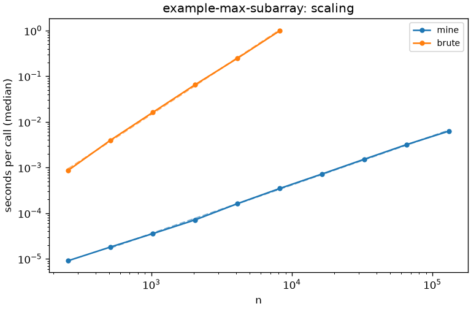
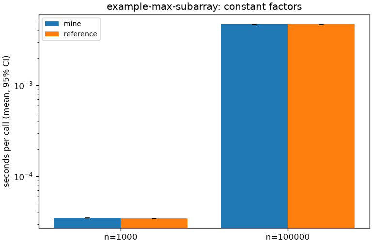

# Bench tables: example-max-subarray

Generated by `scripts/bench_report.py` from `.meta/bench/` at 2026-09-27 13:18 PDT.
Every number in `comparison.md` must appear in this file.

## Empirical scaling (run 2026-09-27T12:33:44-07:00, python)

| impl | points fitted | n range | slope k | R² |
|---|---|---|---|---|
| mine | 9 | 512..131072 | 1.07 | 1.000 |
| brute | 6 | 256..8192 | 2.02 | 1.000 |

Median seconds per call:

| n | mine | brute |
|---|---|---|
| 256 | 9.12 µs | 870 µs |
| 512 | 18.2 µs | 3.99 ms |
| 1024 | 35.7 µs | 16.2 ms |
| 2048 | 71.4 µs | 65.5 ms |
| 4096 | 162 µs | 248 ms |
| 8192 | 348 µs | 993 ms |
| 16384 | 723 µs | - |
| 32768 | 1.52 ms | - |
| 65536 | 3.19 ms | - |
| 131072 | 6.28 ms | - |

## Constant factors

| impl | n | mean | 95% CI of mean | source |
|---|---|---|---|---|
| mine | 1000 | 34.9 µs | 34.8 µs .. 34.9 µs | pytest-benchmark, 21451 rounds |
| reference | 1000 | 34.7 µs | 34.7 µs .. 34.7 µs | pytest-benchmark, 21669 rounds |
| mine | 100000 | 4.67 ms | 4.67 ms .. 4.68 ms | pytest-benchmark, 208 rounds |
| reference | 100000 | 4.68 ms | 4.67 ms .. 4.68 ms | pytest-benchmark, 206 rounds |

Ratios against mine (< 1 means faster than mine). *Separated*: the 95% CIs of the means do not overlap.
*Beyond sd*: |Δ mean| exceeds the larger per-call standard deviation. A speedup claim needs both.

| n | impl | mean / mine | Δ mean | larger sd | separated | beyond sd | claimable |
|---|---|---|---|---|---|---|---|
| 1000 | reference | 0.996 | 133 ns | 952 ns | yes | no | no |
| 100000 | reference | 1.001 | 6.5 µs | 32.9 µs | no | no | no |

